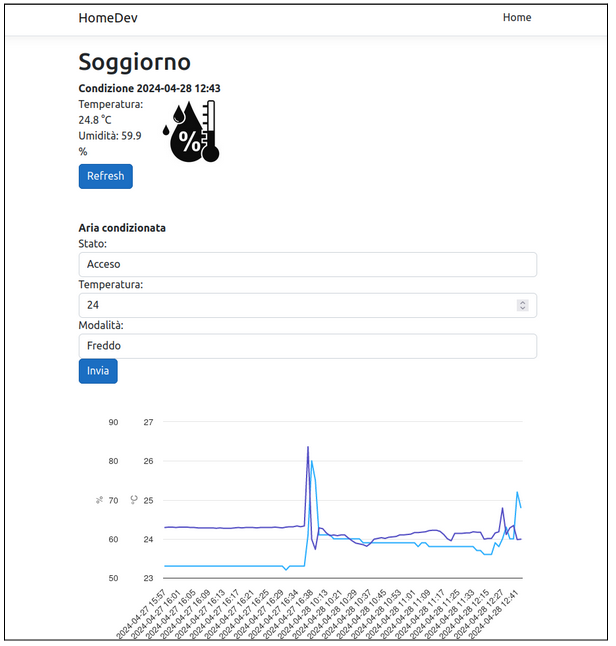
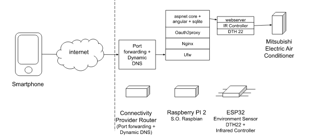

# Air Conditioner Automation

The purspose: remote control of the Mitsubishi Electric Air Conditioner.
* Access a WebApplication made in Angular, AspentCore, Sqlite
  * See the environmental data (temperature, humidity)
  * Send command to the air conditioner
  * Turn on setting temperature and mode (Cool or Hot)
  * Turn off



Component diagram:



## WebApplication
See the code in the WebApplication folder for details

## Esp32 device
Use the Arduino Ide to compile, add the following libraries:
* DHT22
* DHT22
* IRemoteESP8266
* Adafruit Unified Sensor

The library "IRemoteESP8266" is extremily important because it has predefined Infrared commands for a lot of devices.

Things to setup:
* Connect to your home wifi setting "ssid" and "password" in the "sketch_temp_sensor.ino"
* Change your data pin in "sketch_temp_sensor.ino"

Esp32 webserver routes, the they are all Http Get:
| Method  | Description | Request example | Response example |
| ------------- | ------------- | ------------- | ------------- |
| /  | Html page that show the status and explain the possible http commands.  |  |  |
| /dht22  | Show temperature and humidity like a rest api in Json | No parameter required  | {"temperature":20.2, "humidity":30.2} |
| /airconditioning | Return the status of the air conditioner. Mode: 1 heat, 3 cool.  | No parameter required.| {"power": 1, "mode": 3, "temperature": 20.0} |
| /climateon | Turn on the air conditioner. The api returns the status of the air conditioner after the command. | /climateon?temperature=20&mode=3 | {"power": 1, "mode": 3, "temperature": 20.0} |
| /climateoff | Turn off the air conditioner. The api returns the status of the air conditioner after the command. | No parameter required | {"power": 0, "mode": 3, "temperature": 20.0} |

See the code in the Esp32 folder for details

## Ops (putting everything together)

Here are some instruction to setup the Raspberry, in our case the WebServer. Main features:
* Nginx is the reverse proxy, listening at port 80 and 443. Proxy the WebApplication http://localhost:5000
* Oauth2-Proxy add authentication to access the webserver 


Under "/opt" we have all the binaries:

| Directory  | Description |
| ------------- | ------------- |
| /opt/homedev  | Copy of the publish of the WebApplication. |
| /opt/auth2-proxy-v7.6.0.linux-armv7  | Oauth2-proxy binary and the .sh script to start it as a service. |

1. In "/opt/homedev" Copy of the publish of the WebApplication, with the following command:
```
dotnet publish -r linux-arm
```

2. Download the oauth2-proxy in /opt and unzip

Download the oauth2-proxy in /opt and unzip:
```
cd /opt
curl -o -l https://github.com/oauth2-proxy/oauth2-proxy/releases/download/v7.6.0/oauth2-proxy-v7.6.0.linux-armv7.tar.gz
tar -xf ./oauth2-proxy-v7.6.0.linux-armv7.tar.gz
```

Create the script to start the oauth2-proxy. In order to proceed you need to register in the Google Apis & Services (https://console.developers.google.com/project) and obtain "client-id", "client-secret", and create the cookie-secret. The script is:
```
nano /opt/oauth2-proxy-v7.6.0.linux-armv7/myrun.sh
```

```
#!/bin/bash

/opt/oauth2-proxy-v7.6.0.linux-armv7/oauth2-proxy  --client-id=123.googleusercontent.com \
--client-secret=abc \
--provider=google \
--upstream=http://localhost:5000/ \
--cookie-secret=123 \
--cookie-secure=false \
--pass-access-token=false \
--pass-authorization-header=true \
--authenticated-emails-file=/opt/oauth2-proxy-v7.6.0.linux-armv7/allowedlist
```

Limit the access to a list of Google emails:
```
nano /opt/oauth2-proxy-v7.6.0.linux-armv7/allowedlist
youremail@gmail.com
yoursecondemail@gmail.com
```

3. Create the Ubuntu services

Oauth2proxy Service:
```
sudo nano /etc/systemd/system/oauthproxy.service

[Unit]
Description=Oauth proxy service
Wants=network-online.target
After=network-online.target

[Service]
User=u123
WorkingDirectory=/opt/oauth2-proxy-v7.6.0.linux-armv7
ExecStart=/opt/oauth2-proxy-v7.6.0.linux-armv7/myrun.sh

[Install]
WantedBy=multi-user.target
```

Homedev Service:
```
sudo nano /etc/systemd/system/homedev.service
[Unit]
Description=HomeDev Service localhost:5000
Wants=network-online.target
After=network-online.target

[Service]
User=u123
WorkingDirectory=/opt/homedev
ExecStart=/opt/homedev/HomeDev

[Install]
WantedBy=multi-user.target
```

4. Configure a Dynamic DNS service on your router, for example the one of the connectivity provider.

5. Configure Nginx

Setup Certbot to have https connection.

Setup Nginx replacing in the below configuration "mydynamicdns.com" with your dynamic dns name:
```
server {
        listen 80 default_server;
        listen [::]:80 default_server;
        server_name _;

        location /oauth2/ {
        proxy_pass http://127.0.0.1:4180;
        proxy_set_header Host $host;
        proxy_set_header X-Real-IP $remote_addr;
        proxy_set_header X-Scheme $scheme;
        proxy_set_header X-Auth-Request-Redirect $request_uri;
    }

    location / {
        auth_request /oauth2/auth;
        error_page 401 = /oauth2/sign_in;
        # pass information via X-User and X-Email headers to backend
        # requires running with --set-xauthrequest flag
        auth_request_set $user $upstream_http_x_auth_request_user;
        auth_request_set $email $upstream_http_x_auth_request_email;
        auth_request_set $email $upstream_http_x_auth_request_email;
        proxy_set_header X-User $user;
        proxy_set_header X-Email $email;
        proxy_set_header Host $host;
        proxy_set_header X-Real-IP $remote_addr;
        proxy_set_header X-Forwarded-For $proxy_add_x_forwarded_for;    
        proxy_pass_header Server;
        proxy_connect_timeout 3s;
        proxy_read_timeout 10s;

         # if you enabled --cookie-refresh, this is needed for it to work with auth_request
         auth_request_set $auth_cookie $upstream_http_set_cookie;
         add_header Set-Cookie $auth_cookie;
         proxy_pass http://localhost:5000;
    }
}

server {
    server_name mydynamicdns.com; # managed by Certbot

           location /oauth2/ {
        proxy_pass http://127.0.0.1:4180;
        proxy_set_header Host $host;
        proxy_set_header X-Real-IP $remote_addr;
        proxy_set_header X-Scheme $scheme;
        proxy_set_header X-Auth-Request-Redirect $request_uri;
    }

    location / {
        auth_request /oauth2/auth;
        error_page 401 = /oauth2/sign_in;
        # pass information via X-User and X-Email headers to backend
        # requires running with --set-xauthrequest flag
        auth_request_set $user $upstream_http_x_auth_request_user;
        auth_request_set $email $upstream_http_x_auth_request_email;
        auth_request_set $email $upstream_http_x_auth_request_email;
        proxy_set_header X-User $user;
        proxy_set_header X-Email $email;
        proxy_set_header Host $host;
        proxy_set_header X-Real-IP $remote_addr;
        proxy_set_header X-Forwarded-For $proxy_add_x_forwarded_for;    
        proxy_pass_header Server;
        proxy_connect_timeout 3s;
        proxy_read_timeout 10s;

         # if you enabled --cookie-refresh, this is needed for it to work with auth_request
         auth_request_set $auth_cookie $upstream_http_set_cookie;
         add_header Set-Cookie $auth_cookie;
         proxy_pass http://localhost:5000;
    }
    listen [::]:443 ssl ipv6only=on; # managed by Certbot
    listen 443 ssl; # managed by Certbot
    ssl_certificate /etc/letsencrypt/live/mydynamicdns.com/fullchain.pem; # managed by Certbot
    ssl_certificate_key /etc/letsencrypt/live/mydynamicdns.com/privkey.pem; # managed by Certbot
    include /etc/letsencrypt/options-ssl-nginx.conf; # managed by Certbot
    ssl_dhparam /etc/letsencrypt/ssl-dhparams.pem; # managed by Certbot

}
server {
    if ($host = mydynamicdns.com) {
        return 301 https://$host$request_uri;
    } # managed by Certbot


        listen 80 ;
        listen [::]:80 ;
    server_name mydynamicdns.com;
    return 404; # managed by Certbot


}
```